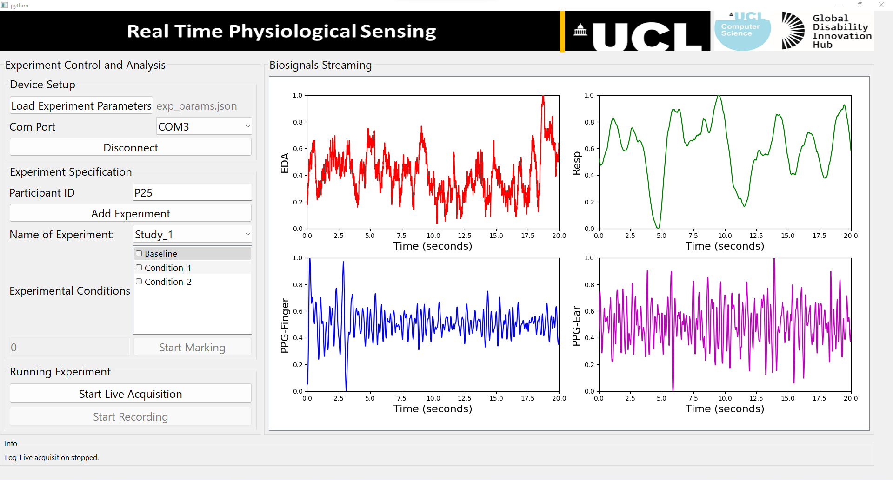

# **PhysioKit**
PhysioKit is a novel physiological computing toolkit which is open-source, accessible and affordable. HCI hobbyists and practitioners can easily access physiological sensing channels that help monitor our physiological signatures and vital signs including heart rate, heart rate variability, breathing rate, electrodermal activities. The toolkit works with a low-cost micro-controller such as Arduino.
Currently, it supports acquiring EDA, Resp and PPG using any low-cost Arduino board.

The PhysioKit comprise hardware and software-application layers. Its hardware consists of physiological sensors and a low-cost micro-controller board e.g Arduino. PhysioKit supports a wide range of existing physiological sensor modules that output continuous signals, that are read using analog input channels of micro-controller board. Its software-application layer includes an interface to configure experimental and acquisition parameters, real-time streaming and visualization of multiple physiological signals, pre-processing and analysis of acquired signals. Data-transmission between micro-controller board and PC is supported using wired (USB) or Bluetooth communication. PhysioKit integrates existing libraries to analyze acquired physiological signals, including photoplethysmography (PPG), breathing signals and electrodermal activity (EDA). For enhanced accessibility, PhysioKit is designed to be compatible with bespoke sensor-mounts. PhysioKit is available for research and academic use.

## **Overview of PhysioKit**
Below figure shows architecture of PhysioKit:
<p align="left">

</p>

## **Installation**
Unzip the package

cd to the directory where requirements.txt is located.

activate your virtual environment

run: pip install -r requirements.txt in your shell.

## **Terminal command to execute the program**
``` bash
python main.py
```
This shall open a UI as below:
<p align="left">

</p>

## **Citing PhysioKit**
Jitesh Joshi, Katherine Wang, and Youngjun Cho. 2023. PhysioKit: Open-source, Accessible Physiological Computing Toolkit. *In Review*