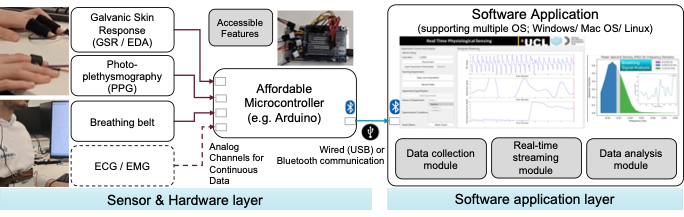

# **Overview of PhysioKit**

Authors: Jitesh Joshi, Katherine Wang, and Youngjun Cho <br>
Contact: Physiological Computing and Artificial Intelligence lab @ GDIH - WHO Collaboration Centre for Assistive Technology, UCL Computer Science  (<youngjun.cho@ucl.ac.uk>)

PhysioKit is a novel physiological computing toolkit which is open-source, accessible and affordable. HCI hobbyists and practitioners can easily access physiological sensing channels that help monitor our physiological signatures and vital signs including heart rate, heart rate variability, breathing rate, electrodermal activities. The toolkit works with a low-cost micro-controller such as Arduino. Currently, it supports acquiring EDA, Resp and PPG using any low-cost Arduino board.

PhysioKit consists of (i) a sensor and hardware layer that can be configured in a modular manner along with research needs, (ii) a software application layer that enables real-time data collection, streaming and visualization for both single and multi-user experiments. This also supports basic visual biofeedback configurations and multi-signal synchronization for co-located or remote multi-user settings.

Below figure shows architecture of PhysioKit:
<p align="left">

</p>

## **Installation**

Pre-requisite: Python >= 3.8

It is recommended to create separate Python virtual environment, which can be achieved using venv/ anaconda/ miniconda as follows. After creating the environment, activate the same.

Using venv:


    Creating virtual environment using venv (recommended for Windows users) -- To be executed once.
``` bash
        cd ~
        mkdir envs
        cd envs
        python -m venv phys .
```
    Activating "phys" environment -- To be executed everytime after opening new terminal/ Powershell window.
``` bash
        ~/envs/phys/Scripts/Activate.ps1
```

Using conda:

    Creating virtual environment using conda -- To be done once
``` bash
        conda create -n phys
```
    Activating "phys" environment -- To be executed everytime after opening new terminal/ Powershell window.
``` bash
        conda activate phys
```

You can then use [PyPI package](https://pypi.org/project/PhysioKit2/) to install PhysioKit, using the below mentioned command:

``` bash
pip install PhysioKit2
```

To update the currently installed package:

``` bash
pip install --upgrade PhysioKit2
```

## **Building wheel (.whl) package from source**
Requires 'build' package that can be installed using pip with following command:

``` bash
pip install build
```

Clone the PhysioKit repository from GitHub and 'cd' to the clonned repo:

``` bash
git clone https://github.com/PhysiologicAILab/PhysioKit.git
cd PhysioKit
```

Make the changes to the repo as required to serve your objectives.
In setup.py, change the version - for your tracking purpose, e.g. 1.8.0 and then build the wheel package:

``` bash
python -m build 
```

Install the package that has been built:

``` bash
python -m pip install .\dist\PhysioKit2-1.8.0-py3-none-any.whl
```

## **Usage Instructions**

### **Step-1: Upload program on the Arduino board**

Connect the Arduino board that you want to use. For this step, the sensors need not be connected.
Navigate to "*arduino/default*" folder (for AVR family boards which are most common, e.g. Nano, Uno, Mega) and as per the number of sensors that you want to use, go to the respective folder and open  the ".ino" file using Arduino IDE.
For example, if you want to use all three supported sensors, you may choose "*three_sensors*" folder and open "*three_sensors.ino*". "*four_sensors.ino*" can be used in a setting where two pulse sensors (at different sensor sites, e.g. finger, ear) are to be used.

Having identified the correct Arduino program, upload the same to the Arduino board using Arduino IDE. If you are unfamiliar with this step, you may have a look at [this](https://support.arduino.cc/hc/en-us/articles/4733418441116-Upload-a-sketch-in-Arduino-IDE) tutorial for detailed instructions on how to upload program on Arduino board.
The Arduino program files for Arm based board (e.g. Due) are also provided at "*arduino/due*" folder, which can be similarly used.

The default sampling rate is 250 samples per second for all boards. If you need to change this, please follow the comments written in the arduino code. Similarly, the default baudrate for AVR boards is set to 115200. To set a different baudrate, both the Arduino program and software configuration file (e.g. *configs/avr_default/sw_config.json*) are required to be changed appropriately.

### **Step-2: Choose or Update Software Configuration File**

If no changes have been made to Arduino program, then it is only required to identify the correct software configuration file. For single-user scenario and default AVR family boards, the config file to be used is *configs/avr_default/sw_config.json*. In this config file, *external_sync* is specified with *enable* field set to *false*.

For multi-user settings, *external_sync* is specified with *enable* field set to *true*. Depending on the *role* speficied for the computer, it can serve either as *server* or as *client* - for which one of the two config files - *sw_config_server.json* or *sw_config_client.json* can be used.

While no changes are required for *sw_config_server.json*, the *client* field in the *sw_config_client.json* file is required to specify the "*server_ip*" address. Please ensure that the "*server_ip*" address is reachable, and both the clients and the server are on the same enterprise network, or reachable using VPN.

### **Step-3: Update Experiment Configuration File**

Experiment configuration file needs to be updated as per the study protocol. This is described below with an illustration of the experiment configuration file used for the validation study of PhysioKit.

Study name and conditions field once specified, are used by the interface to store the acquired data. There are no restrictions on the number of experimental conditions that can be added here.

*channels* are the user-facing names of the sensors that are used in the study. For the interface to plot signals with physiological signal specific filtering, it is required to correctly specify the *channel_types*. The order of *channels*, *channel_types* and the connection of physiological sensors on the analog channels of Arduino board shall match precisely.

If the study protocol requires acquisition for indefinitely long duration with manual stop, then *timed_acquisition* can be specified as *False*, otherwise in every other scenario, this is to be set as *true*. If this is specified as *true*, it is required to specify the acquisition duration (in seconds) separately for each experimental condition.

Using the *datapath* field, we can specify the path at which the acquired data with get stored.

Lastly, as the interface supports marking of asynchronous events, the description about the type of events along with *event_code* can be specified.

        "study_name": "PhysioKit_Validation",
        "conditions": ["baseline", "mathEasy", "mathDifficult", "movement"],
        "channels": ["EDA", "Resp", "PPG Finger", "PPG Ear"],
        "channel_types": ["eda", "resp", "ppg", "ppg"],
        "timed_acquisition": true,
        "max_time_seconds": [180, 180, 180, 180],
        "datapath": "data",
        "event_codes":{
            "0": "event_1",
            "1": "event_2"
        }

### **Step-4: Launch the PhysioKit Interface**

Before launching the interface, ensure that the Arduino board is connected to the computer using USB connection or through Bluetooth connection. At this step, sensors are required to be appropriately connected to the analog channels of Arduino board.

To launch the interface, run the following command in the terminal:

``` bash
physiokit --config <path of config file>
see example below 
physiokit --config configs/avr_default/sw_config.json
```

This shall open user interface, basic functioning of which is shown in this demo. Please note that if secondary screen is connected, the interface uses it to adjust its resolution, however it may have to be moved to the secondary screen if it got launched on the primary.

<p align="left">
    
</p>

A brief description of each step is mentioned below:

> **Step-4a: Connect with the Serial Port**: Select the serial / com-port where Arduino board is connected. Observe the *Info* displayed at the bottom of the interface in the status bar. On successful connection, the *Info* bar shall display the port details along with the baudrate.

> **Step-4b: Browse and select appropriate Experiment Configuration file**: Using the interface, browse the *Experiment Configuration File* as updated in [Step-3](#step-3-update-experiment-configurartion-file). On successful loading of the config file, the interface shall start displaying he plotting area with the specified number of channels. Please note if the number of channels are more than 4, the interface will only show real-time plotting of first four physiological signals as specified in the configuration file.

> **Step-4c: Specify Participant ID**: This allows specifying the participant ID in user preferred manner. The ID specified here will be used for storing the data in organized manner.

> **Step-4d: Select Experiment Condition**: This part of the interface shows a list of conditions as specified in the *Experiment Configuration File* in [Step-3](#step-3-update-experiment-configurartion-file). Each condition listed can be selected with a mouse click. Experimental condition will also be used in naming the file while storing acquired physiological signals.

> **Step-4e: Start Live Acquisition**: In this step, real-time plots can be seen in the plotting area of the interface. Signals are not yet being recorded and the objective at this step is to visually inspect the physiological signals and verify if good quality signals are being acquired.

> **Step-4f: Start Recording**: Having verified the signals with real-time plotting feature, recording can be started with a manual trigger. In case of multi-user settings, all the client computers are required to remain ready for recording the data before the recording starts at the server computer. Pressing *Record Data* on client computer makes it ready to wait for a trigger from the connected server. The recording of the data on all the computers can be started synchronously with a manual trigger at server computer.

> **Step-4g: Marking the Events**: While the recording of physiological signals is in progress, interface allows marking events by pressing *Start Marking* button. Before pressing this, one can choose the relevant *Event Code* from the list which will show the *Event Codes* as specified in [Step-3](#step-3-update-experiment-configurartion-file). The same button then can be pressed to stop marking of the event. These marking information will be stored along with the data samples in CSV file - with the corresponding *Event-Code*.

> **Step-4h: Stopping to Record**: If the *timed_acquisition* field specified in the [Step-3](#step-3-update-experiment-configurartion-file) is set to *true*, the recording will stop after the specified time, and pressing *Stop Recording* will interrupt the planned acquisition. This can be used only in exception cases in which experiment is to be terminated abruptly. However, if the *timed_acquisition* field is set to *false*, then *Stop Recording* is required to be pressed manually to end the acquisition.

---

### **Data Analysis**

Data analysis is supported by the *analysis_helper* folder. To extract features and export in spreadsheet, please refer to the README provided within the folder.
In addition, Jupyter notebooks *phys_analysis_eda.ipynb*, *phys_analysis_ppg.ipynb*, and *phys_analysis_resp.ipynb* are provided to illustrate basic analysis steps. This includes pre-processing as well as feature extraction for EDA, PPG and Resp signals respectively.

---

### **Additional Support or Reporting Issues with the Library**

Please use Github's *Issues* to report any problem you face while using the PhysioKit.

---

### **Citation**

@Article{s23198244,
AUTHOR = {Joshi, Jitesh and Wang, Katherine and Cho, Youngjun},
TITLE = {PhysioKit: An Open-Source, Low-Cost Physiological Computing Toolkit for Single- and Multi-User Studies},
JOURNAL = {Sensors},
VOLUME = {23},
YEAR = {2023},
NUMBER = {19},
ARTICLE-NUMBER = {8244},
URL = {<https://www.mdpi.com/1424-8220/23/19/8244}>,
PubMedID = {37837074},
ISSN = {1424-8220},
DOI = {10.3390/s23198244}
}
