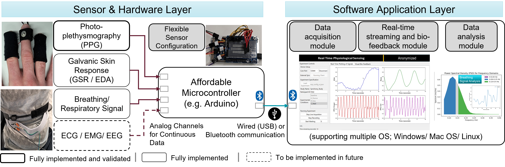

# **PhysioKit**
PhysioKit is a novel physiological computing toolkit which is open-source, accessible and affordable. HCI hobbyists and practitioners can easily access physiological sensing channels that help monitor our physiological signatures and vital signs including heart rate, heart rate variability, breathing rate, electrodermal activities. The toolkit works with a low-cost micro-controller such as Arduino.
Currently, it supports acquiring EDA, Resp and PPG using any low-cost Arduino board.

## **Overview of PhysioKit**
Below figure shows architecture of PhysioKit:
<p align="left">

</p>

The proliferation of physiological sensors opens new opportunities to explore interactions, conduct experiments and evaluate the user experience with continuous monitoring of bodily functions. Commercial devices, however, can be costly or limit access to continuous data, while low-cost tools lack validity and user friendliness. To address the challenges, we introduce PhysioKit, an open-source, low-cost physiological computing toolkit. PhysioKit consists of (i) a sensor and hardware layer that can be configured in a modular manner along with research needs, (ii) a software application layer that enables real-time data collection, streaming and visualization for both single and multi-user experiments. This also supports basic visual biofeedback configurations and multi-signal synchronization for co-located or remote multi-user settings. In a validation study with 15 participants, PhysioKit shows strong agreement with research-grade reference sensors. Then, we report on usability survey results from 10 micro-project teams (44 individual members in total) who use PhysioKit for 4-6 weeks, providing insights into its research benefits, such as "access to raw data". We conclude by discussing its use cases and potential impact on the HCI community.

## **Installation**
Unzip the package

cd to the directory where requirements.txt is located.

activate your virtual environment

run: pip install -r requirements.txt in your shell.


## **Launching the PhysioKit Interface**
``` bash
python main.py --config <path of config file>
e.g. python main.py --config configs/Uno/sw_config.json
```
This shall open user interface, basic functioning of which is shown in this demo:
<p align="left">
    
</p>


## **Citing PhysioKit**
